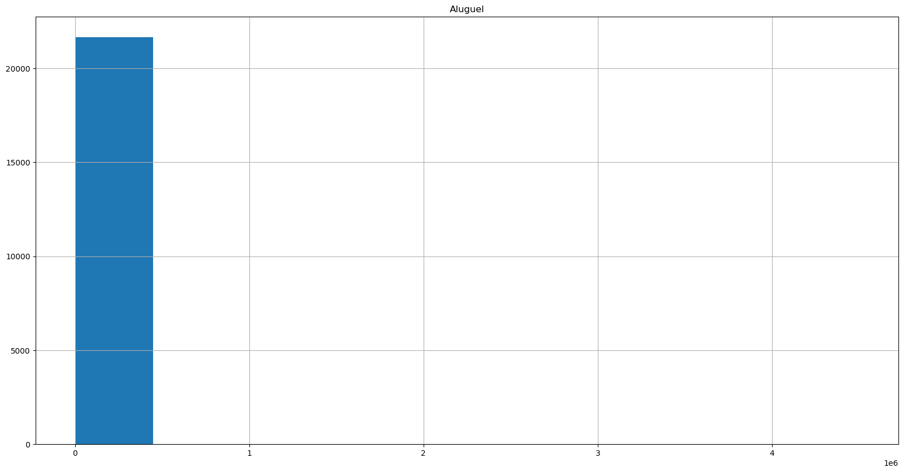
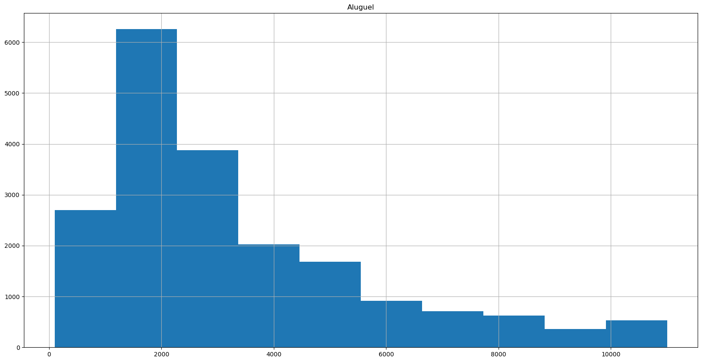
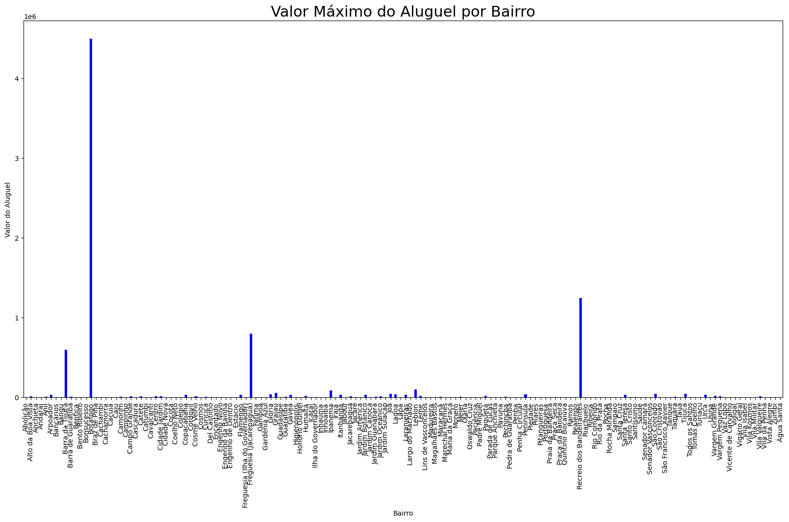
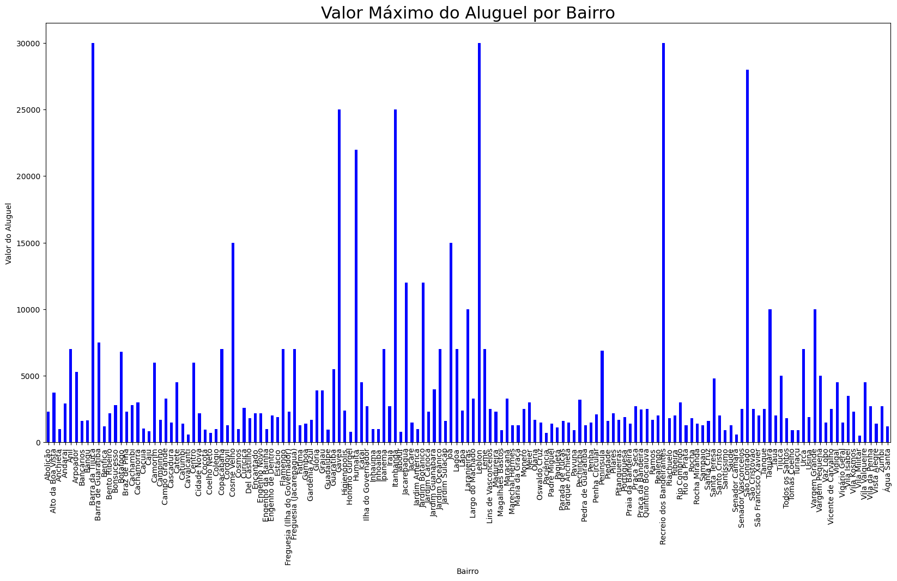
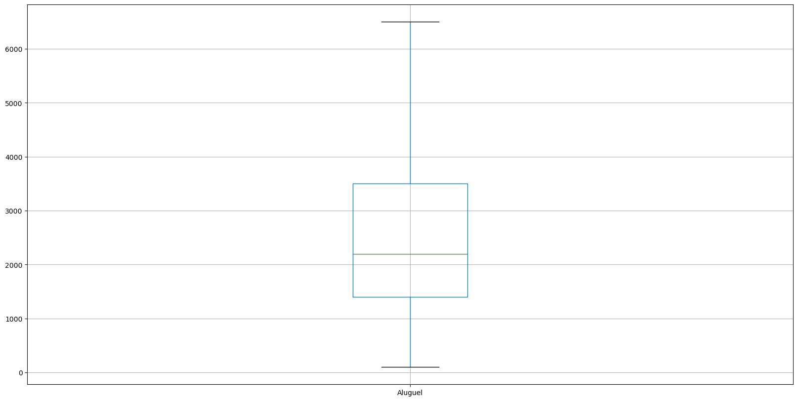

# Análise de Outliers 

## Sumário

* [Sobre o projeto](#sobre-o-projeto)
* [About the project](#about-the-project)
* [Linguagens e tecnologias usadas](#linguagens-e-tecnologias-usadas)
* [Bibliotecas Python usadas](#bibliotecas-python-usadas)
* [Método de eliminar os outliers](#método-de-eliminar-os-outliers)
* [Passo a passo do código](#passo-a-passo-do-código)
* [Gráficos](#gráficos)
* [Conclusões](#conclusões)
* [Créditos](#créditos)
* [Contato](#contato)

## Sobre o projeto

Este repositório contém uma solução para um desafio envolvendo análise de dados e está organizado de maneira detalhada e acessível, podendo ser entendida por quem é iniciante na linguagem Python, principalmente se tiver familiaridade com as biblioteca Pandas.

**Desafio:** Analisar os dados de uma empresa de aluguel de imóveis e fazer o devido tratamento de dados, principalmente para os inúmeros valores nulos, conhecidos como <i>valores missing</i>. O foco da análise são os imóveis residenciais, um subconjunto da base de dados original, que precisa ter os outliers, isto é, os dados com valores muito discrepantes dos outros, retirados.

Estão disponibilizados neste repositório os seguintes arquivos: a base de dados, que contém informações, como valor do aluguel e condomínio, de aproximadamente 33.000 imóveis; a solução detalhada, feita no Jupyter Nootebook, em que estão explicações de como foram desenvolvidas ideias; a solução final, adaptada para o Visual Studio Code a partir da solução detalhada, mas desenvolvida sem a poluição visual dos comentários; a imagem com o esquema do Box Plot, usada no decorrer do README; e a pasta com arquivos gerados no código, como a base de dados tratada, gráficos e capturas de tela.

## About the project

[Em construção ⚠️]

## Linguagens e tecnologias usadas

* [Jupyter Notebook](https://jupyter.org/)
* [Visual Studio Code](https://code.visualstudio.com/download)
* [Python 3.11](https://www.python.org/)
* [Markdown](https://www.markdownguide.org/)

## Bibliotecas Python usadas

* [Pandas](https://pandas.pydata.org/)
* [Matplotlib Pyplot](https://matplotlib.org/3.5.3/api/_as_gen/matplotlib.pyplot.html)

## Método de eliminar os outliers

Para eliminar os outliers, usaremos o Box Plot, também conhecido como diagrama de caixa, que é uma maneira gráfica de representar a alteração dos dados de uma variável por meio de quartis. O esquema abaixo mostra como é delimitado cada quartil, sendo que os pontos localizados nas regiões descritas como outliers são excluídos.

 
  

  - Q1: Valor referente ao primeiro quartil (25%).
  - Q3: Valor referente ao terceiro quartil (75%).
  - IIQ: Intervalo interquartílico, a variação entre o primeiro e o terceito quartil.
  - Limite inferior: representado pela expressão Q1 - 1.5 $\times$ IIQ, uma métrica para saber quais valores inferiores estão muito discrepantes com relação aos outros.
  - Limite superior: representado pela expressão Q3 + 1.5 $\times$ IIQ, para retirar os valores superiores muito destoantes.

## Passo a passo do código

* Passo 1: Importar a base de dados
* Passo 2: Visualizar a base de dados
    * 2.1 Mostrar os tipos de dados
    * 2.2 Mostrar os tipos de imóveis
    * 2.3 Identificar os imóveis residenciais
* Passo 3: Tratar os dados
    * 3.1 Excluir colunas desnecessárias
    * 3.2 Tratar valores nulos do aluguel
    * 3.3 Tratar valores nulos do condomínio
* Passo 4: Analisar os dados
    * 4.1 Calcular do valor bruto e do metro quadrado
    * 4.2 Calcular os valores estatísticos descritivos por bairro
    * 4.3 Remover os outliers
    * 4.4 Recalculando dos valores estatísticos

## Conclusões

O desafio girou em torno dos valores de aluguel de imóveis residenciais, que representam cerca de 66% da base de dados original, aproximadamente 21.500 imóveis divididos em 5 tipos: Apartamento, Quitinete, Casa de Vila, Casa de Condomínio e Casa.

Houveram muitos indícios que a bases de dados estavam com outliers, como pode ser visto nos histogramas sobre a quantidade de imóveis pelo valor do aluguel e sobre valor de aluguel máximo por bairro. Abaixo estão a versão antes e depois de um tratamento de dados, respectivamente.

No primeiro histograma só tem uma coluna, o que indica que os dados não estão bem distribuídos. Ao mesmo tempo, no histograma do valor máximo do aluguel antes do tratamento, vemos que alguns valores de aluguel que são muito altos, existe, por exemplo, um apartamento no Botafogo com 4,5 milhões de aluguel. Há uma possibilidade de haver alguns dados com o preço do imóvel, não com o aluguel.

Como pode ser visto no segundo histograma, sobre a quantidade de imóveis pelo valor do aluguel, a distribuição é assimétrico para a direita, o que indica que a moda é menor que a mediana, as quais é menor que a média, o que foi verificado na análise. Esse tipo de resultado é comum de aparecer ao analisar valores e rendas.

Aplicamos a análise do Box Plot, inicialmente, para todos os imóveis residenciais juntos, como pode ser visto abaixo, mas não é a melhor maneira de analisar. Por exemplo, as Casas de Condomínio costumam ter valores maiores de aluguel, em comparação com as Quitinetes ou Apartamentos, então pode acontecer de serem retirados muitos desses valores como outliers, mesmo que sejam dados que representem bem o conjunto das Casas de Condomínio. Por isso, faremos também a análise por tipo de apartamento, para buscar melhores resultados.

Usando o Box Plot para todos os dados juntos, foram excluídos 4224 imóveis na forma de outliers. Diminuição equivalente à, aproximadamente, 19%.
- Foram 3336 imóveis do tipo "Apartamento". Diminuição equivalente à, aproximadamente, 18%.
- Foram 310 imóveis do tipo "Casa". Diminuição equivalente à, aproximadamente, 32%.
- Foram 573 imóveis do tipo "Casa de Condomínio". Diminuição equivalente à, aproximadamente, 64%.
- Foram 5 imóveis do tipo "Casa de Vila". Diminuição equivalente à, aproximadamente, 2%.
- Foram 0 imóveis do tipo "Quitinete". Diminuição equivalente à, aproximadamente, 0%.

Usando o Box Plot para os dados organizados por tipo, foram excluídos 3495 imóveis na forma de outliers, uma diminuição equivalente à, aproximadamente, 16%.

- Foram 2971 imóveis do tipo "Apartamento". Diminuição equivalente à, aproximadamente, 16%.
- Foram 446 imóveis do tipo "Casa". Diminuição equivalente à, aproximadamente, 46%.
- Foram 28 imóveis do tipo "Casa de Condomínio". Diminuição equivalente à, aproximadamente, 3%.
- Foram 25 imóveis do tipo "Casa de Vila". Diminuição equivalente à, aproximadamente, 10%.
- Foram 25 imóveis do tipo "Quitinete". Diminuição equivalente à, aproximadamente, 3%.

Mesmo usando o Box Plot por tipo de imóvel, as Casas ainda tiveram muitos dados excluídos, então pode ser necessário uma análise de valores superiores e inferiores é uma melhoria que pretendo fazer eventualmente. Outras pontos para melhoria são: Deixar mais apresentável e bonito os títulos e rótulos dos eixos dos gráficos; Melhorar a explicação em alguns trechos, para ficar mais didático; Organizar os bairros, em ordem crescente ou decrescente da média, mediana ou desvio padrão.

## Créditos 

O desafio, bem como muitos detalhes de sua resolução, é baseado nas aulas do Rodrigo Fernando Dias, no curso [Python Pandas: tratando e analisando dados](https://cursos.alura.com.br/course/introducao-python-pandas), da plataforma da [Alura](https://www.alura.com.br/).

## Contato

Criado por Adriano Jr. G. Gonçalves - Sinta-se
à vontade para contribuições, críticas, dúvidas e/ou sugestões.

 
   
  

