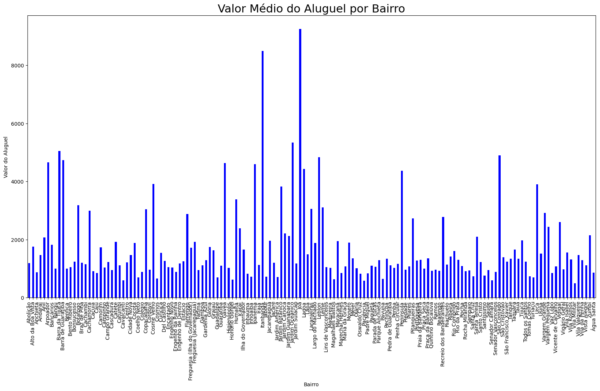

# Análise de Dados Imobiliários [Em construção ⚠️]

## Sumário

* [Sobre o projeto](#sobre-o-projeto)
* [About the project](#about-the-project)
* [Linguagens e tecnologias usadas](#linguagens-e-tecnologias-usadas)
* [Bibliotecas Python usadas](#bibliotecas-python-usadas)
* [Passo a passo do código](#passo-a-passo-do-código)
* [Gráficos](#gráficos)
* [Conclusões](#conclusões)
* [Créditos](#créditos)
* [Contato](#contato)

## Sobre o projeto

Este repositório contém uma solução para um desafio envolvendo análise de dados e é organizado de maneira detalhada e acessível, podendo ser entendida por quem é iniciante na linguagem Python, principalmente se tiver familiaridade com a biblioteca Pandas.

**Desafio:** Analisar, usando Python, os dados de uma empresa de aluguel de imóveis e fazer o devido tratamento de dados, principalmente para os inúmeros valores nulos, conhecidos como <i>valores missing</i>. O foco da análise são os imóveis residenciais, um subconjunto da base de dados original, em que deve ser realizada a seguintes tarefas: (1) Cálculo do valor bruto para morar em cada imóvel; (2) Cálculo do valor do metro quadrado de cada imóvel; (3) Contar a quantidade de imóveis que possuem até 2 quartos, depois 3 e 4 quartos, 5 e 6 e a faixa final de 7 ou mais quartos; (4) Cálculo dos valores estatísticos descritivos do aluguel por bairro; (5) Usando o Box Plot (Ver a figura abaixo), remover os outliers, ou seja, os imóveis com valores muito discrepantes dos outros.

 
  

  - Q1: Valor referente ao primeiro quartil (25%).
  - Q3: Valor referente ao terceiro quartil (75%).
  - IIQ: Intervalo interquartílico, a variação entre o primeiro e o terceito quartil.
  - Limite inferior: representado pela expressão Q1 - 1.5 $\times$ IIQ, uma métrica para saber quais valores inferiores estão muito discrepantes com relação aos outros.
  - Limite superior: representado pela expressão Q3 + 1.5 $\times$ IIQ, para retirar os valores superiores muito destoantes.

Estão disponibilizados neste repositório os seguintes arquivos: a base de dados, que contém informações, como valor do aluguel e condomínio, de aproximadamente 33.000 imóveis; a solução detalhada, feita no Jupyter Nootebook, em que estão explicações de como foram desenvolvidas ideias; a imagem com o esquema do Box Plot; e a pasta com arquivos gerados no código, como a base de dados tratada, gráficos e capturas de tela.

## About the project

[Em construção ⚠️]

## Linguagens e tecnologias usadas

* [Jupyter Notebook](https://jupyter.org/)
* [Visual Studio Code](https://code.visualstudio.com/download)
* [Python 3.11](https://www.python.org/)
* [Markdown](https://www.markdownguide.org/)

## Bibliotecas Python usadas

* [Pandas](https://pandas.pydata.org/)
* [Matplotlib Pyplot](https://matplotlib.org/3.5.3/api/_as_gen/matplotlib.pyplot.html)

## Passo a passo do código

* Passo 1: Importar a base de dados
* Passo 2: Visualizar a base de dados
    * 2.1 Mostrar os tipos de dados
    * 2.2 Mostrar os tipos de imóveis
    * 2.3 Identificar os imóveis residenciais
* Passo 3: Tratar os dados
    * 3.1 Excluir colunas desnecessárias
    * 3.2 Tratar valores nulos do aluguel
    * 3.3 Tratar valores nulos do condomínio
* Passo 4: Resolver as tarefas e realizar uma análise
     * 4.1 Calcular do valor bruto para morar em cada imóvel
     * 4.2 Calcular do valor do metro quadrado de cada imóvel
     * 4.3 Contar a quantidade de imóveis com as quantidades de quartos
     * 4.4 Calcular do valor médio do aluguel por bairro
     * 4.5 Remover os outliers
         * 4.5.1 Remover os outliers para todos os imóveis residenciais
         * 4.5.1 Remover os outliers por tipo de imóvel residencial
     * 4.6 Recalcular dos valores estatísticos descritivos do aluguel

## Gráficos 

Com o código, foram gerados vários gráficos para facilitar a compreenção dos dados e fazer uma melhor análise. Alguns deles podem ser encontrados dentro da pasta [Arquivos gerados no código](https://github.com/DrAdriano/Analise-de-dados-imobiliarios/tree/main/Arquivos%20gerados%20no%20c%C3%B3digo). Abaixo estão 4 exemplos: gráfico de pizza, mostrando os imóveis residenciais por tipo; Um histograma da quantidade de imóveis por faixa de preço; O Box Plot por tipo de imóvel residencial; e um histograma do valor médio do aluguel por bairro.

## Conclusões [Em construção ⚠️]

O desafio gira em torno dos valores de aluguel e, como pode ser visto no histograma de quntidade de imóveis pelo valor do aluguel, a distribuição é assimétrico para a direita, o que indica que a moda é menor que a mediana, as quais é menor que a média, o que foi verificado na análise. Esse tipo de resultado é comum de aparecer ao analizar valores e rendas.

Algumas melhorias que eu pretendo fazer eventualmente: Para não tirar tantos dados, fazer uma análise com valores inferiores e superiores para os casos: com todos os dados residenciais e para os apartamentos e casas, na análise por tipo de imóvel; Deixar mais apresentável e bonito os títulos e rótulos dos eixos dos gráficos; Fazer funções para algumas partes repetitivas do código; Melhorar a explicação em alguns trechos, para ficar mais didático; Colocar os dados organizados por tipo, em ordem crescente ou decrescente; Organizar os bairros, em ordem crescente ou decrescente da média, mediana ou desvio padrão.

## Créditos 

O desafio, bem como muitos detalhes de sua resolução, é baseado nas aulas do Rodrigo Fernando Dias, no curso [Python Pandas: tratando e analisando dados](https://cursos.alura.com.br/course/introducao-python-pandas), da plataforma da [Alura](https://www.alura.com.br/).

## Contato

Criado por Adriano Jr. G. Gonçalves - Sinta-se
à vontade para contribuições, críticas, dúvidas e/ou sugestões.

 
   
  

